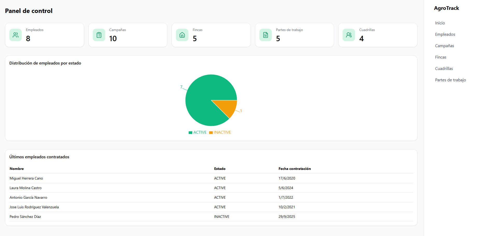
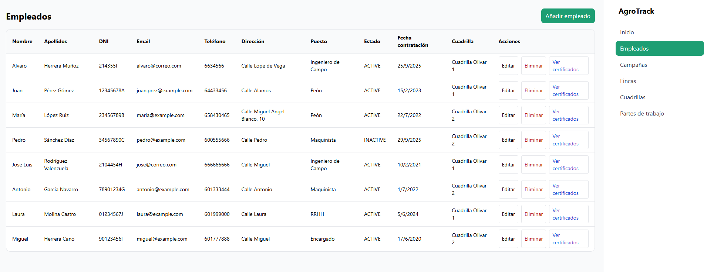
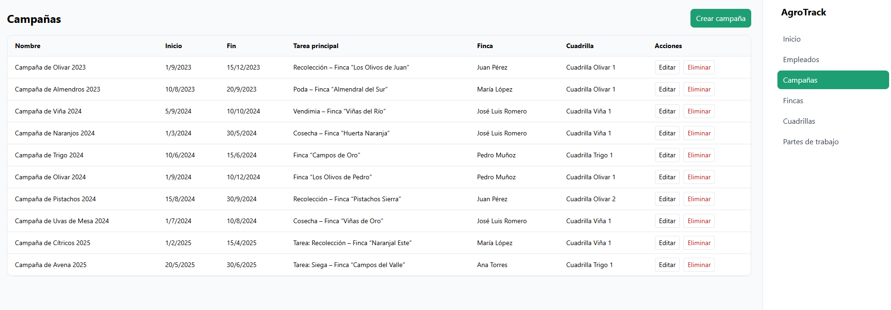
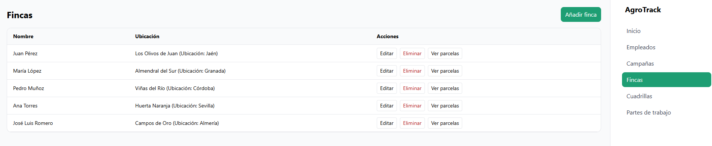
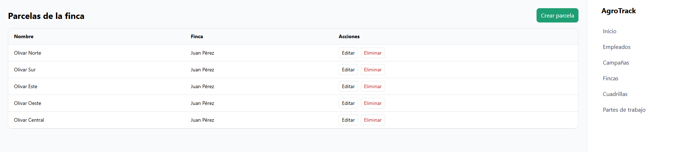

# 🌱 AgroTrack

**AgroTrack** es una aplicación **fullstack** para la gestión agrícola.  
Permite administrar empleados, cuadrillas, campañas, fincas, parcelas, certificados y partes de trabajo de manera sencilla y centralizada.  

Proyecto desarrollado con **Spring Boot (backend)** y **React + Tailwind (frontend)**.  

---

## 🚀 Tecnologías usadas

### Backend
- ☕ **Java 21** + **Spring Boot 3**
- 🗄️ **PostgreSQL** como base de datos
- 📦 **Maven** para gestión de dependencias
- 🔑 **Spring Validation** para validaciones
- 📑 DTOs, Mappers y Services con buenas prácticas

### Frontend
- ⚛️ **React 18**
- 🎨 **TailwindCSS** para estilos
- 🔄 **Axios** para consumo de API
- 🧭 **React Router** para navegación
- ✅ Manejo de modales, confirmaciones y notificaciones (react-hot-toast)


---

## 📸 Capturas de pantalla






---

## ✨ Funcionalidades principales

- **Empleados**  
  - Crear, editar, eliminar empleados  
  - Ver certificados por empleado  
  - Asignar cuadrilla y finca  

- **Certificados**  
  - Gestionar certificados asociados a empleados  
  - Tipos: `FITOSANITARIO`, `MANEJO_CARRETILLA`, `USO_EPI`, `PRL_BASICO`, `MANEJO_MAQUINARIA`  

- **Cuadrillas**  
  - Crear cuadrillas y asignar un encargado (foreman)  
  - Ver listado y gestionar cuadrillas  

- **Campañas**  
  - Crear campañas ligadas a una finca y una cuadrilla  
  - Editar, eliminar y listar campañas  

- **Fincas y parcelas**  
  - Crear fincas y sus parcelas  
  - Relacionar campañas y partes con fincas  

- **Partes de trabajo**  
  - Crear partes diarios de trabajo  
  - Asociar finca, parcela, campaña y cuadrilla   

- **Dashboard inicial**  
  - Resumen de métricas: nº empleados, campañas, fincas, cuadrillas y partes  
  - Gráfico con estadísticas del estado de los empleados  

---

## ⚙️ Instalación y ejecución

### Backend
```bash
cd agrotrack-backend
./mvnw spring-boot:run
cd agrotrack-frontend
npm install
npm run dev
```

## 👨‍💻 Autor

Proyecto desarrollado por **José Luis Rodríguez (Payoyo)**.  
📌 Estudiante de **DAM**, apasionado por el backend con **Java + Spring Boot** y con interés en **cloud, blockchain y sistemas distribuidos**. 
<p align="center">  </p>


